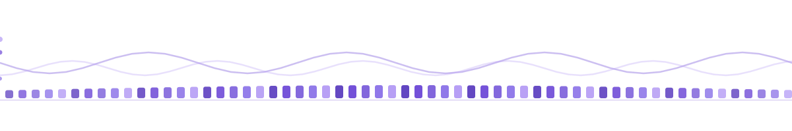

<div align="center">



# Jaskaran Singh

**Builds India's national open-data platform by day — ships offline-first Android apps for fun by night.**

<picture>
  <source media="(prefers-color-scheme: dark)" srcset="https://readme-typing-svg.demolab.com?font=JetBrains+Mono&weight=600&size=22&pause=1000&color=B49BF5&center=true&vCenter=true&width=760&height=55&lines=Assistant+Director+%40+NIC+%C2%B7+MeitY+%C2%B7+Govt+of+India;Scaling+data.gov.in+%E2%80%94+India%27s+Open+Data+platform;PhD+candidate+%40+IIT+Delhi+%C2%B7+building+in+the+open">
  
</picture>

<br>


<br>


</div>

```console
sudo-karan@github:~$ ./init_profile.sh --live
[ ok ] session attached · pipe is hot · streaming below ↓
```

---

## ❯ whoami

<picture>
  <source media="(prefers-color-scheme: dark)" srcset="https://readme-typing-svg.demolab.com?font=JetBrains+Mono&weight=500&size=20&pause=700&color=B49BF5&vCenter=true&width=720&height=45&lines=Jaskaran+Singh+%C2%B7+%40sudo-karan;Assistant+Director+%40+NIC+%E2%80%94+building+data.gov.in;4%2B+yrs+scaling+India%27s+Open+Government+Data+platform;PhD+CS+%40+IIT+Delhi+%C2%B7+ex-McKinsey+Data+Scientist;Loves:+offline-first+%C2%B7+RAG+%C2%B7+geospatial+ML">
  
</picture>

```text
╭─ ~/whoami ──────────────────────────────────────────────
│
│  role     Assistant Director · NIC, MeitY, Govt of India
│  mission  build & scale data.gov.in — India's national OGD platform
│  stack    data pipelines · cloud-native · REST · Elasticsearch · Drupal
│  also     mentor state partners onboarding open datasets
│  study    PhD, Computer Science · IIT Delhi (2025–)
│  loc      New Delhi · UTC+05:30 · Punjabi / Hindi / English
│
╰──────────────────────────────────────────────────────────
```

> **Satellites, not vibes** — my doctoral work is geospatial-ML that teaches Sentinel imagery to read the ground.

---

## ❯ cat currently_building.md

```text
╭─ ~/rag_chatbot ─────────────────────────────────────────
│
│  Offline, air-gapped RAG assistant for data.gov.in.
│  Local Ollama LLM · sentence-transformers · ChromaDB.
│  REST + SSE streaming · Dockerized · hardware-adaptive.
│  Grounded ONLY in official Open Government Data policy docs.
│
│  status  in active development → github.com/sudo-karan/rag_chatbot
╰──────────────────────────────────────────────────────────
```

<picture>
  <source media="(prefers-color-scheme: dark)" srcset="https://readme-typing-svg.demolab.com?font=JetBrains+Mono&weight=500&size=19&pause=800&color=B49BF5&vCenter=true&width=720&height=45&lines=%24+ollama+run+ogd-assistant+--offline;loading+ChromaDB+vectors...;sentence-transformers+ready;answers+only+from+official+OGD+docs;runs+fully+air-gapped+%C2%B7+zero+cloud">
  
</picture>

> **If it needs the cloud to think, I'd rather it didn't.** Nothing leaves the box — no invented policy, no data exfil.

---

## ❯ ls ~/featured

| project | what makes it tick |
|---|---|
| **`rag_chatbot`** · [code](https://github.com/sudo-karan/rag_chatbot) | Offline, air-gapped RAG over data.gov.in — local Ollama LLM + sentence-transformers + ChromaDB, REST+SSE streaming, hardware-adaptive, grounded only in official OGD policy docs. |
| **`boyle-bingo`** · [live](https://sudo-karan.github.io/boyle-bingo/) · [code](https://github.com/sudo-karan/boyle-bingo) | Private multiplayer prediction-bingo PWA. Game rules enforced in **Postgres RLS**, realtime sync + a live leaderboard. React / TS / Supabase. |
| **`pdf-to-markdown`** · [live](https://sudo-karan.github.io/pdf-to-markdown/) · [code](https://github.com/sudo-karan/pdf-to-markdown) | 100% in-browser PDF → Markdown — nothing leaves the tab. Preserves images, diagrams and captions. Built on PDF.js. |
| **`phd-code`** · [code](https://github.com/sudo-karan/phd-code) | Geospatial-ML on Google Earth Engine fusing Sentinel-2 + Sentinel-1 + canopy + terrain across an 11-stage pipeline. Doctoral research. |
| **`claude-usage`** · [code](https://github.com/sudo-karan/claude-usage) | Dark-themed Android app for tracking Claude usage limits, with a Glance home-screen widget. Kotlin / Compose / WorkManager. |
| **`goal_tracker`** · [code](https://github.com/sudo-karan/goal_tracker) | 100% offline Android goal tracker — reboot-surviving reminders + a home widget. Kotlin / Room. |

---

## ❯ stack --list

<div align="center">

<picture>
  <source media="(prefers-color-scheme: dark)" srcset="https://skillicons.dev/icons?i=python,java,kotlin,ts,js,c,postgres&theme=dark">
  
</picture>
<br><sub><b>languages</b> · Python · Java · Kotlin · TS/JS · C · CUDA · SQL</sub>

<picture>
  <source media="(prefers-color-scheme: dark)" srcset="https://skillicons.dev/icons?i=tensorflow,sklearn,elasticsearch,docker,azure,gcp,linux&theme=dark">
  
</picture>
<br><sub><b>ml + data + cloud</b> · ML/DL/NLP · Geospatial ML · REST/Microservices · Elasticsearch · Drupal · Azure · Earth Engine</sub>

<picture>
  <source media="(prefers-color-scheme: dark)" srcset="https://skillicons.dev/icons?i=react,vite,supabase,androidstudio,git,github,bash&theme=dark">
  
</picture>
<br><sub><b>product</b> · React · Vite · PWAs · Jetpack Compose · Supabase · offline-first</sub>

</div>

---

## ❯ top

```text
live process monitor — contribution activity · streak · data stream
```

<div align="center">

<sub><code>FEED</code> — contribution activity</sub>

<picture>
  <source media="(prefers-color-scheme: dark)" srcset="https://github-readme-activity-graph.vercel.app/graph?username=sudo-karan&theme=react-dark&bg_color=0D1117&color=CBBEF1&line=B49BF5&point=EDE7FB&area=true&hide_border=true&radius=12">
  
</picture>

<br>

<sub><code>UPTIME</code> — commit streak</sub>

<picture>
  <source media="(prefers-color-scheme: dark)" srcset="https://github-readme-streak-stats.herokuapp.com/?user=sudo-karan&hide_border=true&background=0D1117&ring=B49BF5&fire=B49BF5&currStreakNum=EDE7FB&sideNums=EDE7FB&currStreakLabel=B49BF5&sideLabels=B8ADD9&dates=8B8299">
  
</picture>

<br>

<sub><code>THROUGHPUT</code> — live data stream</sub>

<picture>
  <source media="(prefers-color-scheme: dark)" srcset="https://raw.githubusercontent.com/sudo-karan/sudo-karan/output/github-snake-dark.svg">
  
</picture>

</div>

---

## ❯ stats --pinned

<div align="center">


</div>

---

## ❯ history

```text
╭─ ~/history ─ career.log ────────────────────────────────
│
│  2025 →   PhD · Computer Science · IIT Delhi
│  2022 →   Assistant Director · NIC, MeitY, Govt of India
│  2021–22  Data Scientist · McKinsey & Company
│           └─ Document AI · built a layout-extraction algorithm
│  2020     Data Science Intern · Sabudh Foundation
│  2019     Systems Engineer Intern · Infosys
│           └─ mail server from scratch: AES-256 + salted hashing + QR admin
│
╰──────────────────────────────────────────────────────────
```

<details>
<summary><b>❯ cat education.log & certs.log</b></summary>

<br>

```text
╭─ ~/history ─ education.log ─────────────────────────────
│
│  M.Tech CSE · PEC Chandigarh (2019–21) · CGPA 9.60
│  B.Tech CSE · Punjabi University Patiala (2015–19) · 8.21
│
│  certs   Azure Data Fundamentals · ML with Python · among others
│  langs   Punjabi (native) · Hindi · English
│  shipped national-scale OGD platform · 20+ projects
│
╰──────────────────────────────────────────────────────────
```

</details>

---

## ❯ connect

<div align="center">

<picture>
  <source media="(prefers-color-scheme: dark)" srcset="https://readme-typing-svg.demolab.com?font=JetBrains+Mono&weight=600&size=19&pause=900&color=B49BF5&center=true&vCenter=true&width=640&height=45&lines=Open+to+research+%2B+dev+collaborations;Let%27s+build+something+that+ships;Reach+out+%E2%80%94+links+below">
  
</picture>

<br>

<a href="https://karan98.in"></a>
<a href="https://www.linkedin.com/in/karan98"></a>
<a href="mailto:jaskaran.pta@gmail.com"></a>
<a href="https://github.com/sudo-karan"></a>

</div>

```console
sudo-karan@github:~$ _   # session still running — thanks for scrolling
```
